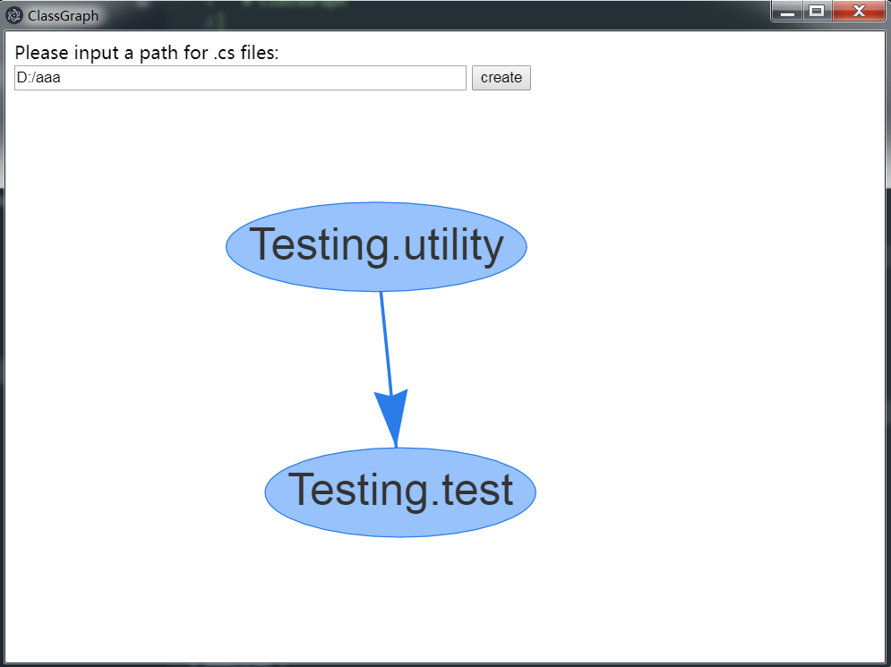

# ClassGraph

## Use for?
make a Class Graph for .cs files

## How to use?
Using "npm start" to start this repo;  
Input a path that contains .cs files;  
Click "create".   
Make sure that the nodejs and electron have been installed before.   

  
The nodes represent the classes.  
The arrow from 'Testing.Utility' to 'Testing.test' means 'Testing.test' calls 'Testing.Utility'.
 
## Why create this repo?
I am handling a big C# project which has many classes calling each other.  
So I want a software to analyze the relationship among the classes.  
Since the 'codemap' is not in the community version of Visual Studio.  
And another VS plugin called '[Code graph](https://github.com/league1991/CodeAtlasVsix)' is a very cool software, but it seems too complicated.
As a result, I do it by myself.
I learn to use electron to transfer the awesome '[vis-network](https://github.com/visjs/vis-network)' to the desktop.

## But...
To compare with the great softwares above, this repo is too simple and the code is not cool at all. But I think the requirements are clear.  
So, if you are interested in this repo, please promote the code and make it more useful.  
If you know other software instead, plaease tell me! Thank you!
